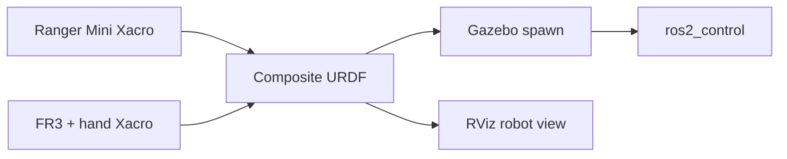

# Franka FR3 × Ranger Mini V2 | Composite Robot Model

<p align="center"><strong>ROS 2 Humble · URDF/Xacro · Gazebo Classic · ros2_control</strong></p>
<p align="center">A robot-description and simulation integration for mounting a Franka FR3 arm on an AgileX Ranger Mini V2 mobile base.</p>

<p align="center">
  
  
</p>

> **Project boundary:** This repository focuses on robot assembly and Gazebo control setup. The later [MoveIt integration workspace](https://github.com/fjc6666/Combining-the-motion-planning-of-Franka-and-Ranger-Mini-without-servo) contains planning configuration. This repository includes upstream Franka/Ranger descriptions and controllers; the integration is the project-specific layer.

## What is implemented

| Part | Code to inspect |
| --- | --- |
| Composite URDF | [mobile_manipulator.urdf.xacro](composite_robot_description/urdf/mobile_manipulator.urdf.xacro) |
| Gazebo launch | [display_sim.launch.py](composite_robot_description/launch/display_sim.launch.py) |
| Controller configuration | [controllers.yaml](composite_robot_description/config/controllers.yaml) |
| Ranger base description | [ranger_mini_v2_description](ranger_mini_v2_description) |
| Franka arm description | [franka_description](franka_description) |

The Xacro combines the four wheel assemblies, FR3 arm, and Franka hand. It loads hand inertia data from YAML and declares finger joint control interfaces. The Gazebo launch parses the model, starts robot_state_publisher and Gazebo, spawns the robot, then starts the joint-state and arm controllers.



## Build and inspect

**Target environment:** Ubuntu 22.04, ROS 2 Humble, Gazebo Classic, Xacro, ros2_control, and colcon. Install Git LFS before cloning because the repository tracks large DAE meshes.

```bash
sudo apt install git-lfs python3-colcon-common-extensions python3-rosdep \
  ros-humble-gazebo-ros-pkgs ros-humble-gazebo-ros2-control \
  ros-humble-ros2-controllers ros-humble-xacro
git lfs install
mkdir -p ~/mobile_manipulator_ws/src
cd ~/mobile_manipulator_ws/src
git clone https://github.com/fjc6666/franka-combined-with-ranger-mini.git
cd ~/mobile_manipulator_ws
source /opt/ros/humble/setup.bash
rosdep install --from-paths src --ignore-src -r -y
colcon build --symlink-install
source install/setup.bash
ros2 launch composite_robot_description display_sim.launch.py
```

**Launch caveat:** display_sim.launch.py points RViz to config/config.rviz, but that file is absent from the checked-in composite_robot_description package. The model and Gazebo portion can be inspected; RViz may need to be started without that preset or given a saved local configuration. Hardware and clean-machine runtime were not validated in this documentation update.

## 中文简介

本仓库解决 FR3 机械臂与 Ranger Mini V2 底盘的模型组合及 Gazebo 仿真接入，重点包括 Xacro 层级、安装位姿、手爪惯量与控制接口、控制器启动顺序。它属于**模型与仿真基础阶段**；MoveIt 运动规划配置在后续独立仓库。当前仓库的 RViz 预设文件缺失，使用时可能需要手动指定配置。
